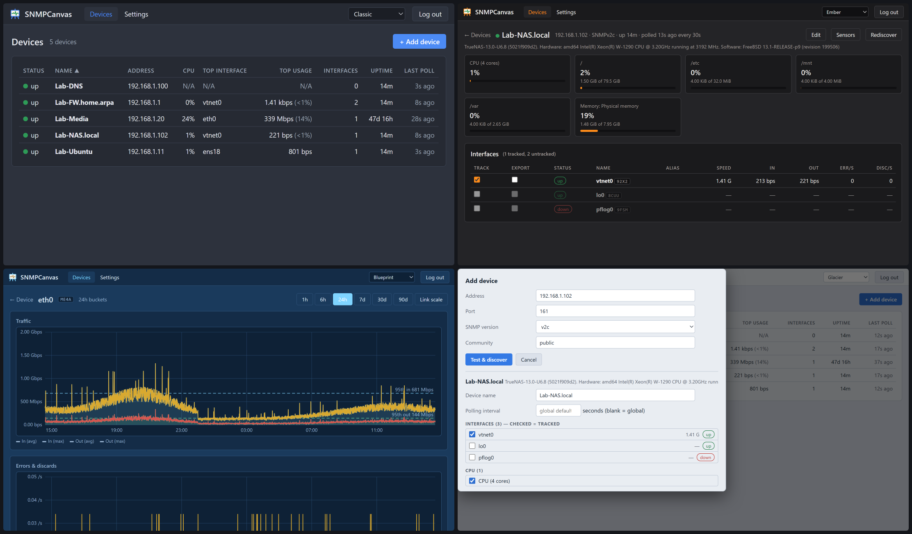

# SNMPCanvas - Basic SNMP Monitoring

> A lightweight, self-hostable SNMP monitor for home labs and small
> networks: poll your devices over SNMPv2c/v3, keep the history in SQLite,
> and browse it in a dependency-light web UI.

SNMPCanvas answers two questions about the gear you already have: *how is it
doing right now*, and *what was it doing last night when things got weird*.
It polls interface traffic, CPU, memory, storage, and temperatures on an
interval you choose, keeps a configurable window of history, and draws the
graphs. It is the third member of the Canvas family:
[**CrossCanvas**](https://github.com/RootSwitch/CrossCanvas) draws your
network, [**PingCanvas**](https://github.com/RootSwitch/PingCanvas) turns
those diagrams into a live reachability wall, and SNMPCanvas adds the
performance history - including an export file that PingCanvas-style
dashboards can ingest (schema below).

Unlike its sisters, SNMPCanvas has a backend: polling needs a process that
outlives a browser tab, and history needs somewhere to live. The family's
small-footprint ethos carries over all the same - one container, one SQLite
file, two runtime dependencies, and a frontend that is still plain
HTML/CSS/JS with no build step.



## How it works

```
your devices ──SNMP (UDP/161)──► SNMPCanvas ──► SQLite ──► web UI & graphs
   (v2c/v3)                          │
                                     └──► snmp-status.json ──► dashboards
```

One Node process does everything: an in-process scheduler polls each device
on its interval, counter deltas become rates, samples land in SQLite, and
the same process serves the UI. Interfaces you mark for **export** are also
written to a small JSON status file every cycle, for other tools to read.

## Features

- **Devices list** - up/down status, CPU, busiest interface, uptime, last
  poll; sortable by any column.
- **Device page** - CPU / memory / filesystem / temperature / fan cards
  (when the device exposes them), then every interface with live in/out
  rates, errors, and discards. A filter box and per-interface Track/Export
  toggles keep big switches manageable.
- **History graphs** - click any interface or resource card: traffic
  (average + peak), errors/discards, a link-status strip, and dashed
  95th-percentile lines, from 1 hour to 90 days. Charts are hand-drawn SVG
  that follows the app theme, with an optional link-speed scale for honest
  utilization reading.
- **Add-device flow** - enter an address and credentials; SNMPCanvas
  verifies with a GET, walks the standard tables, and shows you everything
  it found so you choose what gets tracked. No MIB files involved -
  everything is well-known numeric OIDs (see `server/oids.js`).
- **SNMPv2c and v3** - v3 auth MD5/SHA-1/SHA-256/SHA-512, privacy
  DES/AES-128 and both AES-256 key-localization variants (Blumenthal and
  Reeder/Cisco - devices vary, and the wizard offers both).
- **Interface export** - check the **Export** box on any interface and its
  latest stats are written atomically to `snmp-status.json` after every
  poll, with short stable per-interface codes for easy mapping.
- **Tunable data volume** - a global polling interval (default 30 seconds,
  per-device override) and retention window (default 90 days, pruned
  nightly). At the defaults, expect roughly 2,900 samples per tracked
  entity per day.
- **Single shared password** for the UI (scrypt-hashed), sessions, login
  rate limiting, and one-click database backups from the Settings page.
- **21 themes** carried over from CrossCanvas's palette family, grouped the
  same way.

## Small on purpose

SNMPCanvas is intentionally a store of SNMP data with a clear window onto
it: polling, history, graphs, and the export file. Auto-discovery, topology,
alerting, and automation aren't on the roadmap - they are jobs for tools
built around them, and the pieces here are shaped to sit alongside those
tools rather than replace them (reachability alerting pairs naturally with
an uptime monitor; the wall display is PingCanvas's whole job). Keeping the
moving parts few is a design choice - and if you want it to become something
bigger, the license makes forking genuinely easy.

## Quick start (Docker)

```yaml
# docker-compose.yml
services:
  snmpcanvas:
    build: .        # or a published image once available
    ports: ["9161:9161"]
    volumes: ["./data:/data:z"]   # :z = SELinux label; harmless elsewhere
    environment:
      - TZ=Etc/UTC                # your timezone: prune schedule + log stamps
    restart: unless-stopped
```

```
mkdir -p data && sudo chown 1000:1000 data   # container runs as uid 1000
docker compose up -d
```

Open `http://host:9161`, set the admin password on the first-run page, and
add a device. That's the whole install. (The default port is a nod to SNMP's
UDP/161, picked to coexist quietly with common home-lab neighbors like
UptimeKuma on 3001 and CrossCanvas/PingCanvas on 8080/8443.)

### HTTPS

Run the included script once on the docker host, then restart:

```
./tools/gen-cert.sh 192.168.1.50 nas.lan    # your host's IPs / names
docker compose restart
```

It writes a self-signed cert to `data/certs/server.crt` + `server.key`; the
server detects the pair at startup and switches to HTTPS on the same port
(session cookies become `Secure` automatically). Prefer a real certificate?
Place your own PEM pair at those two paths (or point `TLS_CERT`/`TLS_KEY`
elsewhere) - nothing else changes. Delete the files to fall back to HTTP.

If you mount a different host directory at `/data` (say `/srv/noc-data`),
the certs belong in *that* directory's `certs/` subfolder - tell the script
with `CERT_DIR=/srv/noc-data/certs ./tools/gen-cert.sh ...`. And if HTTPS
doesn't come up after a restart, the server stayed on HTTP because it
couldn't use the cert - `docker compose logs snmpcanvas | grep -i tls` names
the cause, which is almost always one of two things: the pair isn't at
`<data>/certs/server.crt` + `server.key`, or it isn't readable by uid 1000
(`sudo chown -R 1000:1000 <data>/certs` fixes that one).

### Customizing the deployment

Put host-specific settings (volume paths, environment variables, ports) in a
`docker-compose.override.yml` next to the compose file - Docker Compose
merges it automatically, and it's gitignored so updates never conflict with
your edits:

```yaml
# docker-compose.override.yml (example)
services:
  snmpcanvas:
    volumes:
      - /projects/noc-data:/data:z   # replaces ./data (same container path)
    environment:
      - TZ=America/Chicago
```

### Updating an existing install

```
git pull
sudo docker compose up -d --build
```

`up -d --build` rebuilds the image and recreates the container only when
something changed; the data directory is a bind mount, so devices, history,
and settings ride through every update (schema migrations run automatically
on first boot). Old image layers accumulate over time - an occasional
`sudo docker image prune -f` tidies them up.

### Running without Docker

Node 20+: `npm install && npm start` (listens on `:9161`, data in `./data`).

## Configuration (environment variables)

| Variable | Default | Purpose |
|---|---|---|
| `PORT` | `9161` | HTTP/HTTPS listen port |
| `SNMPCANVAS_DATA` | `/data` | Directory for the SQLite db, certs, and default export file |
| `TLS_CERT` / `TLS_KEY` | `$DATA/certs/server.crt|key` | PEM cert/key pair; HTTPS turns on when both exist |
| `ADMIN_PASSWORD` | – | Pre-set the UI password (otherwise first-run setup page) |
| `SNMPCANVAS_SECRET` | – | If set, SNMP credentials are AES-256-GCM encrypted at rest |
| `POLL_CONCURRENCY` | `4` | Max devices polled simultaneously |
| `COOKIE_SECURE` | auto | `Secure` cookies: on with HTTPS, off with HTTP; set to override |
| `TZ` | UTC | Timezone for the nightly prune and log timestamps |

Polling interval, retention days, and the export path are set in the UI
(Settings) and stored in the database.

## Security posture

SNMPCanvas is a networked app with a small, deliberate threat model:

- SNMP credentials are stored in the SQLite database because the poller
  sends them on every cycle. By default the protection is filesystem
  permissions on the `/data` volume; set `SNMPCANVAS_SECRET` and they are
  AES-256-GCM encrypted with a key derived from your secret instead (lose
  the secret, re-enter the credentials).
- The web UI has one shared password and is designed for a trusted network
  segment; a reverse proxy adds TLS termination and extra auth cleanly if
  you want to go further.
- SNMP polls leave the container as outbound UDP/161 through Docker's NAT,
  so devices see the **docker host's** IP. If your devices restrict SNMP by
  source address, allow the host IP - or run the container with
  `network_mode: host` or a macvlan.

## snmp-status.json

Every poll cycle, everything marked **Export** is written atomically to one
file (default `/data/snmp-status.json`). Interfaces go to `interfaces[]`;
every other exported sensor - CPU, memory, disk, temperature, fan, power,
utilization, plus per-device uptime (Edit dialog) - goes to `metrics[]` as a
code plus a short pre-formatted `display` string, so a consumer like
PingCanvas can stay a dumb "code -> text" swapper:

```json
{
  "schemaVersion": 2,
  "interfaces": [ ... ],
  "metrics": [
    { "code": "C1", "kind": "cpu", "host": "compute-01",
      "display": "CPU 45%", "value": 45, "unit": "%", "status": "ok",
      "sampledAt": "2026-07-17T01:10:42Z" }
  ]
}
```

Only `kind:"cpu"` carries a coloring `status` (`ok` under 85%, `warn` to
94%, `crit` at 95%+) - everything else is display-only, so a wall shows the
number without screaming about it. Unavailable values keep their entry with
`display: "--"`. Export checkboxes live in the interface table (interfaces),
the **Sensors** dialog (everything else), and the device **Edit** dialog
(uptime); each exported item shows its code chip in the UI.

The v1 `interfaces[]` shape is unchanged:

```json
{
  "schemaVersion": 1,
  "generator": "snmpcanvas/0.1.0",
  "generatedAt": "2026-07-16T14:05:03Z",
  "interfaces": [
    {
      "id": "core-sw1:eth0",
      "code": "K7Q2",
      "device": { "name": "core-sw1", "host": "10.0.0.2", "status": "up" },
      "ifIndex": 1,
      "name": "eth0",
      "alias": "uplink to fw",
      "speedBps": 1000000000,
      "adminStatus": "up",
      "operStatus": "up",
      "sampledAt": "2026-07-16T14:05:01Z",
      "inBps": 12345678.9,
      "outBps": 234567.1,
      "inErrorsPerSec": 0,
      "outErrorsPerSec": 0,
      "inDiscardsPerSec": 0,
      "outDiscardsPerSec": 0
    }
  ]
}
```

Rates are `null` when unknown (first poll after add/reboot, device down);
metadata is retained while a device is down so a dashboard can grey the tile
out instead of losing it.

`code` is a short, stable key for consumers that don't want to type the full
`id`: 4+ characters derived from `md5(deviceName:ifName)` (confusable
characters excluded, lengthened only on hash collision), minted once and
stored with the interface. It survives un-export/re-export, rediscovery, and
even deleting and re-adding a device - the same device and interface names
produce the same code. Each interface shows its code in the UI on the device
page.

Because the export path defaults to `/data/snmp-status.json` and `/data` is
a bind mount, the file lands **on the docker host** - another container on
the same host (a PingCanvas deployment, say) can bind-mount that directory
read-only and ingest it directly. To write it somewhere else, add a second
volume (e.g. `- /srv/dashboards:/export`) and set Settings → export path to
`/export/snmp-status.json`.

## How discovery works (and how to extend it)

At add time SNMPCanvas GETs the system group, then walks:

- `ifTable`/`ifXTable` - interfaces, with 64-bit counters when available
  (per-interface fallback to 32-bit with a sanity clamp, and a heads-up
  warning on fast links that only offer 32-bit counters),
- `hrProcessorLoad` and `hrStorageTable` (HOST-RESOURCES-MIB) - CPU, RAM,
  and fixed disks on Linux, Windows, and many appliances,
- **temperature and fan sensors** - LM-SENSORS-MIB (lmsensors on
  Linux/Proxmox; TrueNAS exposes per-drive temps this way), the standard
  ENTITY-SENSOR-MIB, vendor health OIDs (Cisco ENVMON, MikroTik), and the
  ASRock Rack BMC sensor table - IPMI controllers make great SNMP devices
  in their own right, reading fan tachometers and temperatures straight
  off the hardware even when the host OS can't. Junk readings (unconnected
  headers, 0 °C placeholders, "Not Available" rows) and redundant per-core
  sensors are listed but left untracked by default,
- the **vendor map** in [`server/oids.js`](server/oids.js), matched by
  `sysObjectID` prefix - vendor CPU/memory OIDs for network devices that
  don't speak HOST-RESOURCES. Cisco (`CISCO-PROCESS-MIB`,
  `CISCO-MEMORY-POOL-MIB`) is included, and adding a vendor is one data
  entry. PRs with tested entries are very welcome.

Devices that expose none of the CPU/memory tables simply don't show those
cards - interfaces still work fully.

### Custom sensors via snmpd `extend`

Anything a shell command can print becomes a sensor. On the monitored host,
add `extend` directives to `/etc/snmp/snmpd.conf` whose **names pick the
kind by prefix** - `temp-` (°C), `fan-` (RPM), `power-` (watts), `util-`
(percent) - and whose output is a single number:

```
extend temp-GPU   /usr/bin/nvidia-smi --query-gpu=temperature.gpu --format=csv,noheader,nounits
extend power-GPU  /usr/bin/nvidia-smi --query-gpu=power.draw --format=csv,noheader,nounits
extend util-GPU   /usr/bin/nvidia-smi --query-gpu=utilization.gpu --format=csv,noheader,nounits
```

Restart snmpd, rediscover the device, and the outputs appear as sensor
cards with history. This is the doorway for data SNMP can't see natively:
NVIDIA GPUs (no hwmon - AMD GPUs surface through lm-sensors automatically),
UPS runtime, anything scriptable. The command runs under the *agent's*
account on the monitored host - SNMPCanvas only ever reads the published
number. (NVIDIA note: `fan.speed` reports percent, not RPM - name it
`util-GPU-Fan`, not `fan-`.)

If a device renumbers its `ifIndex`es (some do, after reboots or module
changes), affected interfaces are flagged **stale** in the UI; use
**Rediscover** on the device page to reconcile - new entities are added,
vanished ones stop being polled but keep their history. On Cisco,
`snmp-server ifindex persist` avoids the situation entirely.

## Development

```
npm install
npm run mock-agent    # fake SNMP device on udp/16100 (v2c "public", v3 "labuser")
npm start             # UI on http://localhost:9161
```

Add `127.0.0.1:16100` as a device and you have moving graphs without any
hardware.

### Project layout

| Path | Purpose |
|---|---|
| `server/server.js` | HTTP entry point: static files + API dispatch (plain `node:http`) |
| `server/api.js` | All `/api/*` handlers |
| `server/oids.js` | Every OID used, plus the vendor map - the file to extend |
| `server/snmp.js` | net-snmp wrapper (v2c/v3 sessions, walks, Counter64 handling) |
| `server/discover.js` | Add-device probe and table walks |
| `server/poller.js` | Tick scheduler, rate math, up/down, nightly prune |
| `server/exporter.js` | `snmp-status.json` writer |
| `server/db.js` / `auth.js` | SQLite schema and migrations; scrypt password + sessions |
| `public/` | The whole frontend: vanilla HTML/CSS/JS, no build step |
| `tools/mock-agent.js` | Fake device for development |

Runtime dependencies:
[`net-snmp`](https://www.npmjs.com/package/net-snmp) and
[`better-sqlite3`](https://www.npmjs.com/package/better-sqlite3) - the
complete list, by design.

## Contributing

Bug reports are welcome via Issues, and **tested vendor-map entries are
especially useful**: if your device's CPU, memory, or temperature OIDs
aren't discovered, an issue with a sanitized `snmpwalk` (or a one-entry PR
against `server/oids.js`) is what makes support for it happen. Small,
self-contained fixes are welcome as pull requests too.

For larger features - alerting, discovery, rollups, and the like - I'd
rather you fork than open a big PR. SNMPCanvas is deliberately small, the
whole backend is nine readable files, and The Unlicense means you owe nobody
anything. Build the monitor you want.

## Credits

SNMPCanvas stands on two excellent MIT-licensed libraries:

- [**net-snmp**](https://github.com/markabrahams/node-net-snmp) by Mark
  Abrahams, Stephen Vickers, and contributors - the pure-JavaScript SNMP
  engine behind every poll, walk, and v3 handshake (its agent support powers
  `tools/mock-agent.js` too).
- [**better-sqlite3**](https://github.com/WiseLibs/better-sqlite3) by Joshua
  Wise and contributors - the synchronous SQLite bindings that keep the
  storage layer a single dependency, wrapping the public-domain
  [SQLite](https://sqlite.org) library itself.

The visual language is borrowed from
[CrossCanvas](https://github.com/RootSwitch/CrossCanvas), SNMPCanvas's
sister project.

## License

[The Unlicense](LICENSE) - public domain, same as CrossCanvas and
PingCanvas. Use it, fork it, ship it at work, no attribution required.
(Dependencies keep their own MIT licenses in `node_modules/` when you
install or ship an image.)
